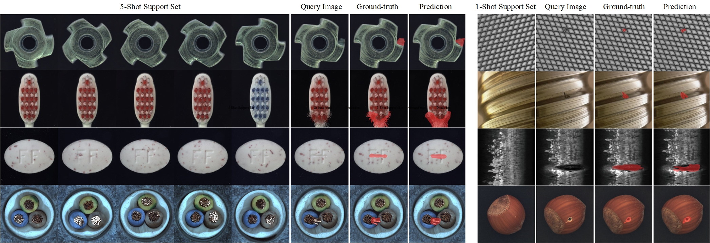

# Multi-Simlarity Based Hyperrelation Network for Few-Shot Segmentation

This is the implementation of the paper ["Few-Shot Semantic Segmentation for Industrial Defect Recognition"]. 

Implemented on Python 3.8 and Pytorch 1.9.
The main structure of the network is as follows:
<p align="middle">
    
</p>


## Requirements

- Python 3.8
- PyTorch 1.13
- cuda 11.7
- opencv 4.3
- tensorboard 2.5.1

## Preparing Industrial Datasets

> Download from [[ScienceDB](https://www.scidb.cn/anonymous/alVKek0z)].


## Testing

> Pretrained models are available on our [[ScienceDB](https://www.scidb.cn/anonymous/YWlBMzJ5)].

>Set the parameters in test.py and execute:
> `python test.py`


#### Example of qualitative results (5-shot and 1-shot):

<p align="middle">
    
</p>
   
## Acknowledgment
Thanks to Juhong Min, Dahyun Kang and Minsu Ch for their contributions, much of our code is based on their shared [HSNet](https://github.com/juhongm999/hsnet).
## BibTeX
If you use this code for your research, please consider citing:
````BibTeX
@InProceedings{
    title={Few-Shot Semantic Segmentation for Industrial Defect Recognition},
    author={Xiangwen Shi, Shaobing Zhang, Miao Cheng, Lian He, Zhe Cui, Xianghong Tang},
}
````
